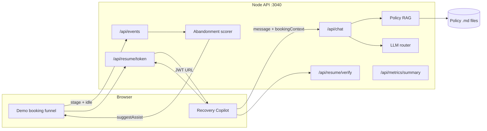
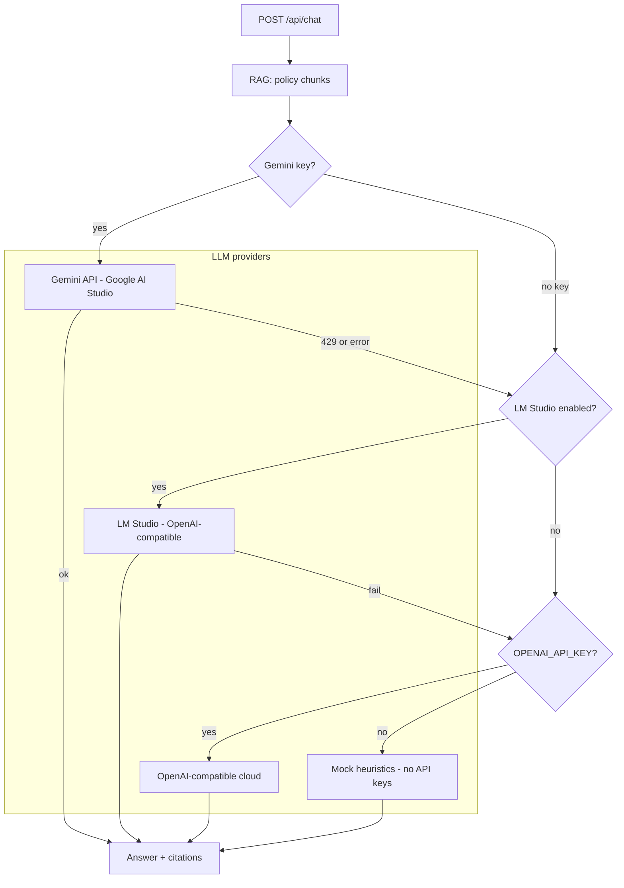
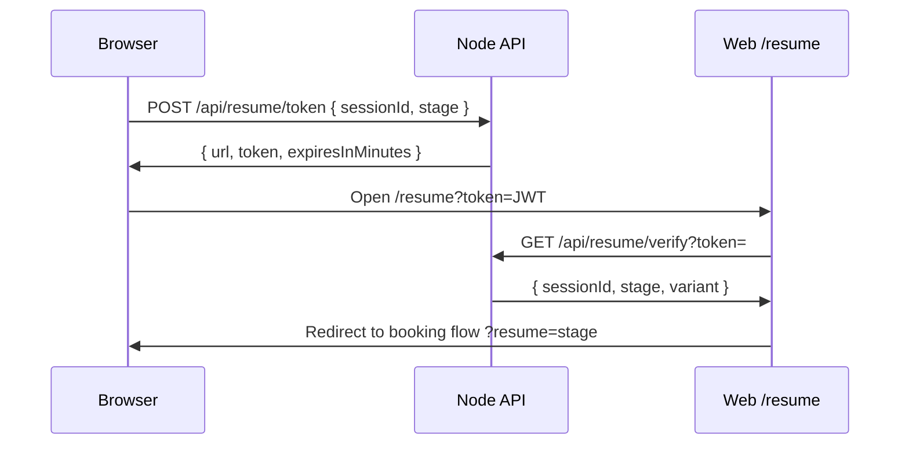

# AI Booking Recovery MVP

## Run the project

```bash
cd booking-recovery-mvp
npm install
```

Edit **`server/.env`**: set **`GEMINI_API_KEY`** or **`GOOGLE_API_KEY`** (Google AI Studio) for cloud answers. 
Optional: **LM Studio** (`LM_STUDIO_ENABLED=1`, `LM_STUDIO_BASE_URL`, `LM_STUDIO_MODEL`) or **OpenAI**-compatible fallback — see `server/.env`.

```bash
npm run dev
```

**Open the app:** http://localhost:5174

**A/B experiment (sticky in the browser):** The **first visit** on a browser defaults to **copilot** (Recovery Copilot enabled). Open **http://localhost:5174?exp=control** once to lock the **control** variant (no copilot API), or **?exp=copilot** to force copilot again. That stores **`experiment_variant`** in **`localStorage`**, so later visits on the same browser keep that assignment until you change the query param or clear site data.

**Production build (optional):**

```bash
npm run build
npm start
```

## Architecture & hand-in detail

Detailed **architecture**, **RAG / LLM flow**, **abandonment & copilot triggers**, **resume links**, **MVP → production** notes, and **Mermaid diagrams** are in **[SUBMISSION.md](./SUBMISSION.md)**.

---

## Screenshots


| Screenshot | Description |
|------------|-------------|
|  | Copilot greeting / first reply |
|  | Flex vs Saver style comparison (filename as saved) |
|  | Lower-cost add-on suggestions |
|  | Cheapest total / how to lower cost |
|  | OTA / cheaper elsewhere handling |
|  | Customer care / escalation context |
|  | Policy citation / source link |
|  | Resume link flow (filename as saved) |
|  | LM Studio fallback model |
|  | Extra baggage / misc question |
|  | Flight delay style response |
|  | Misc question handling |


## Architecture







