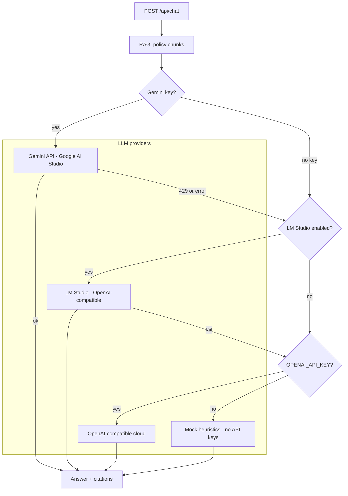
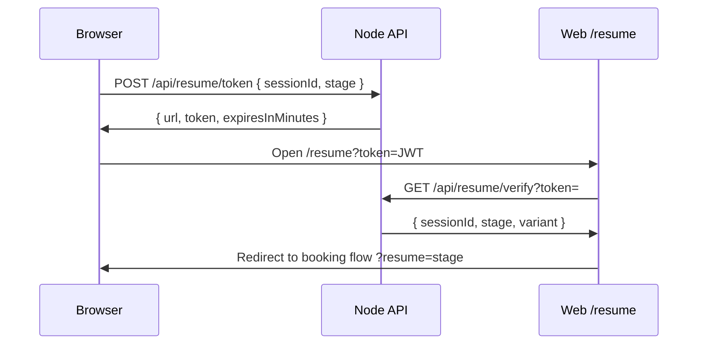
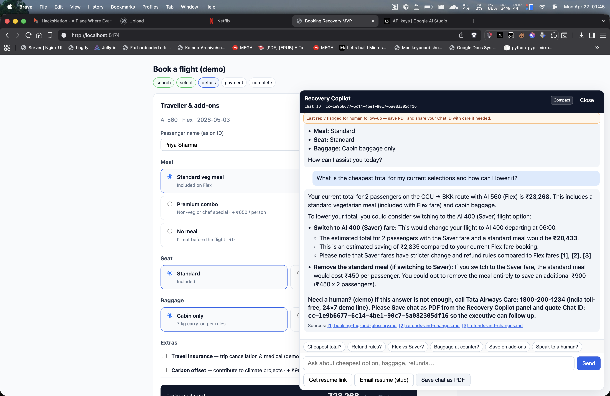
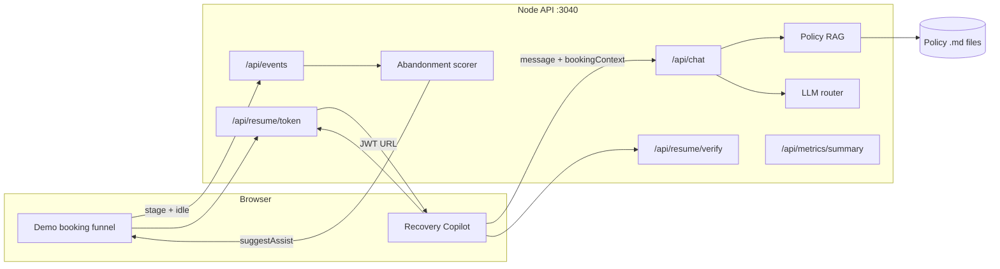

# Case Scenario — AI Booking Recovery MVP Submission


---

## 1. Business problem (from the case)

- Travellers show **strong intent** (search → flight → details) but **abandon before payment**.
- Consequences: **lost direct revenue**, **commission to agents/OTAs**, weaker **CX/data**, fewer **ancillary** sales.
- Case expectation: an **optimal MVP**, **AI-powered**, with **rationale for the tech stack**.

**This MVP** combines: (1) **instrumented funnel + rule-based abandonment scoring**, (2) **Recovery Copilot** (RAG-grounded Q&A + live booking context), (3) **secure resume links** and **notify stub** to close the loop back to the website.

---

## 2. Solution overview

| Capability | What it does |
|------------|----------------|
| **Instrumented journey** | Stages: `search` → `select` → `details` → `payment` → `complete`; client sends `POST /api/events` with `sessionId`, `stage`, `idleMs`, and payload (add-on changes, step-backs, totals). |
| **Abandonment / hesitation** | Server scores sessions (`server/src/abandonment.ts`); returns `suggestAssist` + `signal` on each event response. |
| **Recovery Copilot** | **Copilot variant** — slide-over chat calling `POST /api/chat` with **policy RAG** + **BOOKING_CONTEXT** JSON. |
| **RAG** | Retrieves top‑K policy chunks from `server/policies/*.md` (lexical overlap + query expansion for MVP demo). |
| **LLM stack** | **Google Gemini** (primary, AI Studio REST) → optional **LM Studio** on Gemini failure → optional **OpenAI** if configured. **Mock** answers if no keys provided. |
| **Resume link** | `POST /api/resume/token` issues a **JWT** (`sessionId`, `stage`, `variant`); user opens `/resume?token=…`, verifies via `GET /api/resume/verify`. |
| **Chat PDF** | Client-side export (jsPDF) from the copilot panel; **Chat ID** quoted for care handoff. |
| **Escalation** | If the model ends with `[[UNCERTAIN]]`, the API strips the tag and appends a **demo care** footer with **DEMO_CARE_PHONE** + Chat ID. |
<!-- | **A/B** | `control` (no copilot API) vs `copilot`; `GET /api/metrics/summary` aggregates funnel + chat + resume stats. (optional)| -->

---

## 3. When is the Recovery Copilot triggered automatically?

1. The client periodically sends **stage events** (`details` / `payment` every ~5s while on that stage, and on stage change) to `POST /api/events` including **client idle time** (`idleMs`).
2. The server maintains **session aggregates** (max idle, last stage, add-on churn, step-backs, etc.) and runs **`scoreAbandonment()`**.
3. When **`suggestAssist === true`** (score ≥ 40; demo tuned for ~**10s idle** on payment/details among other rules), the API returns that in the JSON.
4. The web app shows a **yellow “high drop-off risk”** hint and, **once per session** when risk first fires, bumps **`assistOpenNonce`** so the **Recovery Copilot panel opens automatically** (see `DemoBookingFlow.tsx` + `RecoveryCopilot.tsx`).

**Signals** (examples): `payment_hesitation`, `details_hesitation`, `idle` — driven by idle threshold **`IDLE_ALERT_MS = 10_000`** and stage-aware scoring in `abandonment.ts`.

**Additional auto-open (from `docs/UI_NAVIGATION.md`):** If the user lands from a **resume URL** (`/resume?token=…`), the copilot **auto-opens** on arrival so they can continue the conversation.

Users can always open the copilot manually via the **“Recovery Copilot”** launcher.

---

## 4. What context does the copilot use?

Each chat request sends:

| Context | Role |
|---------|------|
| **`BOOKING_CONTEXT`** (JSON from the live demo UI) | Route, stage, passengers, selected flight/add-ons, **`pricingLines`**, **`demoPricingRules`**, **`checkoutGrandTotalInr` / taxes / subtotal** (aligned with on-screen totals), `availableFlights`, `marketFlightsToDestination`, home-city transfer hints, etc. |
| **`POLICY_CONTEXT`** (from RAG) | Numbered snippets `[1]…[n]` from markdown policies — refunds/changes, baggage, seats/meals, insurance, check-in, contact/grievance, FAQs. |
| **`COPILOT_CHAT_ID`** | Stable id (`cc-…`) for care reference; echoed in escalation footer and PDF. |

The **system prompt** (`server/src/llm.ts`) instructs the model to: mirror selections, quote **checkout totals** for “what do I pay”, use **policy citations** only in the `[n]` range shown, avoid raw planning dumps (sanitization layer also strips common chain-of-thought patterns in `copilotTextSanitize.ts`).

---

## 5. What purpose does RAG serve?

- **Problem:** Raw LLMs **hallucinate** on airline rules and fares.
- **MVP approach:** **Retrieval-Augmented Generation** — for each user message, **`retrievePolicyChunks()`** selects the top **K** chunks (default **6**, configurable **`RAG_TOP_K`**) from **`server/policies/`** after simple **token overlap** scoring + **phrase expansion** (e.g. baggage/refund/OTA wording) in `server/src/rag.ts`.
- **Outcome:** Answers are **anchored to airline-written snippets**; the UI can show **citations** (`ref` → policy file links) when the model cites `[1]`, `[2]`, etc.

**Production next step:** swap lexical retrieval for **embeddings + pgvector** (or vendor search) over the policy source-of-truth.

---

## 6. Which AI and APIs are used? Fallback order



| Provider | Config (`server/.env`) | Notes |
|----------|-------------------------|--------|
| **Primary** | `GEMINI_API_KEY` or `GOOGLE_API_KEY`, `GEMINI_MODEL` (default `gemini-2.0-flash`) | REST `generateContent`; max output tokens via `GEMINI_MAX_OUTPUT_TOKENS`. |
| **Fallback 1** | `LM_STUDIO_ENABLED=1`, `LM_STUDIO_BASE_URL`, `LM_STUDIO_MODEL` | Used after **Gemini errors** (e.g. **429**), or if **no Gemini key** and LM Studio is configured (see `llm.ts` routing). |
| **Fallback 2** | `OPENAI_API_KEY`, `OPENAI_BASE_URL`, `OPENAI_CHAT_MODEL` | OpenAI-compatible **cloud** if Gemini fails and LM Studio is off/unreachable. |
| **No keys** | — | **`mockAnswer()`** returns deterministic canned guidance using booking context + chunks. |

**OpenAI-compatible request:** `max_tokens` from `OPENAI_COMPAT_MAX_TOKENS` (and related env vars); parser supports **string or array `content`**, and **`reasoning_content`** when `content` is empty (some local models).

---

## 7. Resume link (security & UX)



- **JWT** signed with **`RESUME_JWT_SECRET`**, TTL **`RESUME_TOKEN_TTL_MINUTES`** (default 120).
- **URL base** from **`WEB_PUBLIC_ORIGIN`** (must match the SPA origin in dev/prod).
- **Demo limitation (stated in docs):** the SPA does not restore a server-side cart; it **proves token + stage re-entry**. Production would hydrate PNR/cart server-side.

---

## 8. Chat PDF, Chat ID, policy links

- **Save chat as PDF** (Recovery Copilot header actions): exports the thread via **jsPDF** (line-wrapped, ASCII-safe for standard fonts).
- **Chat ID** (`cc-<uuid>`): generated client-side, returned/sticky from `/api/chat`; shown in UI and **quoted when calling care** after `[[UNCERTAIN]]`.
- **Sources:** citation chips link to **`/policies/<file>.md`** for transparency.

---

## 9. Tech stack rationale (case expectation)

| Layer | Choice | Rationale |
|-------|--------|-----------|
| UI | **React + Vite** | Fast iteration, embeddable “widget” pattern for existing booking sites. |
| API | **Node + TypeScript + Express** | Simple **event ingestion**, JWT, and LLM orchestration. |
| AI | **Gemini + optional LM Studio / OpenAI** | Strong quality/latency tradeoff for demos; **local fallback** when quota or network issues hit. |
| Retrieval | **Markdown on disk + lexical scoring** | No database dependency for the MVP demo; clears path to **vector DB**. |
| Resume | **JWT** | Stateless, time-boxed **deep links** without booking-core changes in MVP. |
| Experiment | **Header + localStorage** | Lightweight **control vs copilot** without a feature-flag vendor. |

---

## 10. Screenshot




---

## 11. Architecture (end-to-end)



---

## 12. How to run

```bash
cd booking-recovery-mvp
npm install
# Add GEMINI_API_KEY (and/or configure LM Studio per README)
npm run dev
```

- **Web:** `http://localhost:5174` (first visit defaults to **copilot**; use **`?exp=control`** to opt into the control arm, or **`?exp=copilot`** to re-lock copilot).  
- **API:** `http://localhost:3040` (proxied from Vite in dev).  
<!-- - **Metrics:** `GET http://localhost:3040/api/metrics/summary` -->

---

## 13. MVP → production: what should change

The MVP is intentionally **browser-led**, **in-memory**, and **policy-light**. Moving to production means hardening **identity**, **data**, **compliance**, **booking truth**, and **operations**. 

### 13.1 Data access & integrations

| Capability | MVP implementation | Production expectation |
|------------|----------------------|-------------------------|
| Funnel events | `POST /api/events` from browser | **Server-side + client beacons**; identity stitching across devices |
| Session ID | `localStorage` UUID | **First-party cookie** + **server session** / login |
| Policy grounding | Markdown files in `server/policies/` | **CMS / legal PDFs** indexed to a **vector store** with versioning and legal sign-off |
| LLM | Optional cloud + local OpenAI-compatible API | **VPC / private endpoint**, allow-lists, **PII redaction** before model call, regional / airline AI policy |
| Resume links | Signed JWT, short TTL | **Booking PNR or server cart restore**, fraud / replay checks, rate limits, optional step-up auth |
| Notifications | `POST /api/notify` logs only | **Twilio / WhatsApp Business / ESP** with **consent registry** and template compliance |

**Stakeholder validation:** consent copy, regional messaging rules, and **which booking step may be deep-linked** without exposing price or PII in URLs.

### 13.2 Additional production upgrades

| Area | MVP | Production |
|------|-----|------------|
| **Telemetry store** | In-memory session/event aggregates in Node | **Stream to warehouse** (Kafka/Snowflake/BigQuery); retention and GDPR/CCPA erasure workflows |
| **Abandonment** | Rule-based score (`abandonment.ts`) | **ML propensity** + calibrated thresholds; guardrails on false positives (spammy copilot) |
| **RAG** | Lexical overlap + query expansion | **Embeddings + pgvector** (or vendor RAG); chunking tuned to fare rule structure; **eval sets** and citation QA |
| **Chat** | No auth on `/api/chat`; rate limits minimal | **Authenticated sessions**, per-user/IP **rate limits**, prompt-injection tests, **content moderation**, audit log of Q&A |
| **BOOKING_CONTEXT** | Demo JSON from React state | **Server-authoritative** cart/PNR from booking engine; never trust client-only totals |
| **Copilot UI** | Floating widget in demo SPA | **Embeddable SDK** or iframe with brand tokens; WCAG, i18n, mobile keyboard |
| **Resume** | JWT proves `sessionId` + `stage` only | Bind token to **logged-in user** or **opaque server session**; hydrate inventory and price lock server-side |
| **Metrics** | `GET /api/metrics/summary` in-process | Product analytics (Amplitude/Mixpanel), **experiment platform**, error tracking (Sentry) |
| **Secrets** | `.env` on host | **Secret manager** (Vault, AWS SM), key rotation, no keys in client |
| **High availability** | Single Node process | Horizontally scaled API, health checks, circuit breakers to LLM providers |
| **PDF / Chat ID** | Client export + demo care line | **Official care** integration, CRM ticket creation, optional **server-stored** transcript with consent |

---
<!-- 

### 14.1 A/B experiment & metrics (`docs/EXPERIMENT.md`)

| Topic | Detail |
|-------|--------|
| **Variants** | **`control`** — no Recovery Copilot; `POST /api/chat` returns **403** with control header. **`copilot`** — widget, chat, resume links enabled. |
| **Assignment** | Web: first visit defaults to **`copilot`**; sticky **`localStorage`** key `experiment_variant`, override via **`?exp=control`** or **`?exp=copilot`**. API: header **`X-Experiment-Variant`** with value **`control`** or **`copilot`** on `/api/events` and related calls. |
| **Hypothesis** | Copilot + resume increases **payment-stage completion** vs control for high-intent sessions. |
| **Primary metrics** | (1) Payment completion = reached `complete` / reached `payment`. (2) Resume recovery = completed after resume / resume links issued. |
| **MVP API metrics** | `GET /api/metrics/summary`: `reachedSelect`, `reachedDetails`, `chatTurns`, `resumeVerifications`, `funnelRates.selectToPayment`, `funnelRates.paymentToComplete`, etc. |
| **Guardrails** | p95 **`/api/chat` latency**; **% responses with ≥1 policy citation** (chunk id returned). |
| **Analysis / phase 2** | Export raw events from store to **warehouse / BI** (not in MVP build). | -->

### 14.2 Demo UI walkthrough

| Area | Reviewer note |
|------|----------------|
| **Top of page** | **Variant badge** (`control` vs `copilot`); **step pills** across the funnel; **yellow banner** when abandonment risk fires; expandable **“How to use this demo”**. |
| **Search → select → details → payment → complete** | One-way vs round-trip (visual only; pricing one-way); flight **Saver vs Flex** cards; **traveller + add-ons** with live total; **payment** summary; **complete** confirmation. |
| **Idle demo** | On **payment**, stay idle **~10s** (no mouse move) to trigger risk banner and **one** auto-expand of copilot. |
| **Copilot actions** | **Get resume link**; **Email me (stub)** — logs via `POST /api/notify` (see README). |
| **Other controls** | **Back / Next** with validation; **Refresh metrics JSON** → `GET /api/metrics/summary`. |
| **Smooth demo tips** | Force copilot URL; toggle meal to show total change; idle on payment for banner + auto-open (same doc). |


## Screenshots


| Screenshot | Description |
|------------|-------------|
|  | Copilot greeting / first reply |
|  | Flex vs Saver style comparison (filename as saved) |
|  | Lower-cost add-on suggestions |
|  | Cheapest total / how to lower cost |
|  | OTA / cheaper elsewhere handling |
|  | Customer care / escalation context |
|  | Policy citation / source link |
|  | Resume link flow (filename as saved) |
|  | LM Studio fallback model |
|  | Extra baggage / misc question |
|  | Flight delay style response |
|  | Misc question handling |
